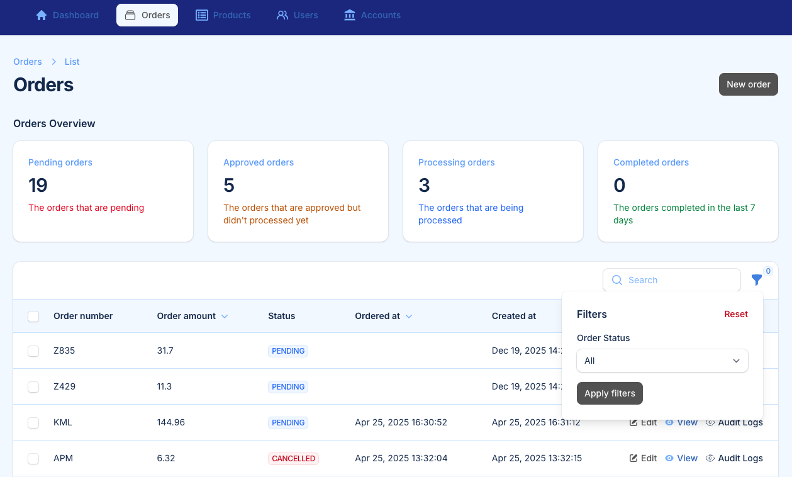

# Order App
Order App is a simple application designed to manage and track account orders efficiently. It provides an intuitive interface for users to create, view, and update orders.

## API Documentation
The Account Admin can create API user. Account admin must create API Token to connect to the API.

Doc url: [https://documenter.getpostman.com/view/15974/2sB3dWqS2g](https://documenter.getpostman.com/view/15974/2sB3dWqS2g)


## Features
- Create new orders
- View order details
- Update existing orders
- Manage account information
- The Accounts can Create API users and generate API tokens (for account admins)

## Pages
1. **Home Page**: Overview of the application and quick access to features.
2. **Order List**: Displays all orders with filtering and sorting options.
3. **Order Details**: View and edit specific order information.
4. **Account Management**: Manage account profiles and contact details.
5. **Settings**: Configure application preferences.
6. **API Management**: Allows account admins to create API users and generate API tokens.
7. **Audit Management**: Provides a comprehensive log of all actions performed within the application, enabling portal admins to monitor activity and ensure compliance with organizational policies.


## Available Roles

**Portal Admin**: Highest level of the portal management role

**Portal User**: This user can updat ethe orders and track the stock and product management.

**Account Admin**: Can list the account users, can generate API user and track the orders

**Account User**: Can list and view the orders

**Account API User**: This is a vertual user, can be used only in API access.

## API Endpoints

Account API User is granted to access the users.  

* list all orders - API User

    ```
    {{url}}/api/orders
    ```

* create an order

    ```
    {{url}}/api/orders
    ```

* view an order

    ```
    {{url}}/api/products/{{order_number}}
    ```


* list all products

    ```
    {{url}}/api/products
    ```

* view a product

    ```
    {{url}}/api/products/{{SKU}}
    ```


## Installation

### Laravel Installation
1. Clone the repository:
    ```bash
    git clone https://github.com/kemalyen/order-app.git
    cd order-app
    ```

2. Install dependencies:
    ```bash
    composer install
    ```

3. Copy the `.env` file and configure your environment:
    ```bash
    cp .env.example .env
    ```

4. Generate the application key:
    ```bash
    php artisan key:generate
    ```

5. Run migrations to set up the database and sample data:
    ```bash
    php artisan migrate:fresh --seed
    ```

6. Serve the application:
    ```bash
    php artisan serve
    ```

### Database Seeder
To populate the database with initial data, use the following command:
```bash
php artisan db:seed
```

You can also seed specific classes:
```bash
php artisan db:seed --class=YourSeederClassName
```


Ensure that your database is properly configured in the `.env` file before running the seeder.


The default portal username is `admin@example.com` and password is `password`

## License

This project is licensed under the [MIT License](https://opensource.org/licenses/MIT).